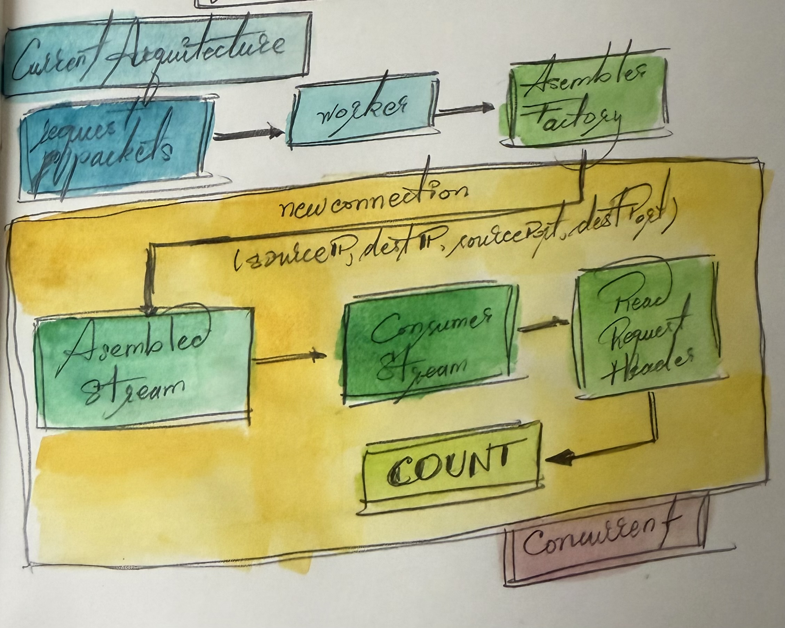

# NetSniffer

As in the PDF the main thing that we need to create is a Network sniffer that
allows us to check the behaviour of the network.

Main points to deliver:

1. Total number of http request detected.
2. Histogram of the top 10 requested hosts by number of queries descending.

## HOW TO BUILD

Requirements:

- Go 1.26+
- **libpcap** — gopacket links it through CGo (`-lpcap`). macOS ships it
  already; on Debian/Ubuntu install `libpcap-dev`.
- We are locked in MacOS for the current state of this implementation.

Build with `make build` (or `go build -o NetSniffer ./src`). Live capture needs
root, so the binary is always run under `sudo` (see below).

## HOW TO TEST

### LOCAL TEST

- Terminal A: `python3 local_server.py 8080`
- Terminal B:
  `sudo ./NetSniffer -device lo0 -BPF "tcp dst port 8080" -log /tmp/sniff.log -seconds 20`
  it can also be `make local`
- Terminal C: `bash test_local.sh`

Recording of a local test run:

### INTERNET TEST

- Terminal A: `sudo ./NetSniffer -log /tmp/sniff.log -seconds 20` it can also
  be `make run`
- Terminal B: `bash test.sh`

Recording of an internet test run:

## HOW IT WAS BUILD

When I started solving the problem, the main thing that I wanted to solve was
how to get the packets and how to read them to get to the host name. So for
that implementation what I did is just pick up the packets and put them through
and http request reader and get the value from there, and then I would add the
host and add +1 to the counter of requests made.

The issue arrived when locally I started using more complicated sessions that
had cookies and other information that actually made the header of the request
bigger than the packet and I couldn't pick up the host.

To solve this, I read more about networks and realiced that the header is not
pinned to the maximum size of the packet, needing a new way to be able to read
several packets that come from the same request.

That new way is the StreamAsembler, what we do is that we take the net and the
tcp layer of the packet and create a ConsumerStream where we will handle all
the packets that have the same net and tcp layer, allowing us to reconstruct
the request and read the Host.

For lack of time and understanding of the package, I did not know that we
didn't had to copy the packet to our buffer, but that we can read it directly
from the network. One good thing about copying the packet is that it makes our
process seamless and non blocking for the user. If we don't copy the
information, we are need to read the packet and process it, before handing it
over again to the user, and we have to remember that tcp reader operations are
blocking. But I am also aware that we are dealing with an unbound map for hosts
and literally doubling the size of the network requests, which could provoque a
resource constrain.

This is the architecture chosen:

Packets that pass the BPF filter reach the `worker`, which hands each one to
the `AssemblerStreamFactory`. On every new connection (keyed by the 4-tuple
sourceIP, destIP, sourcePort, destPort) the factory spins up a `ConsumerStream`
that reassembles that connection's bytes, reads the request header, and
increments the count. Each stream runs in its own goroutine, so connections are
processed concurrently.

## COMPLEXITY

Notation:

**N** = total requests counted

**U** = distinct hosts (U <= N).

- **Ingest, per request:** `Add` is an O(1) amortized map insert plus two
  counter increments under a lock. Across the whole run: **O(N)**.
- **`Ranking()` (runs once, at report time):**
  - clone the hosts map — O(U) time, O(U) memory
  - build the `[]HostCount` slice — O(U)
  - `slices.SortFunc` (pdqsort), descending by count then ascending by name —
    **O(U log U)**
  - take the first 10 — O(1)
- **Rendering:** O(min(10, U)).
- **Memory:** **O(U)** — one entry per distinct host.

Histogram generation is therefore **O(U log U)** time and **O(U)** memory.
Since we only need the top 10, a full sort is more than necessary — a size-10
heap or quickselect would be **O(U)** — but U is small and this happens once at
shutdown, so the sort is never the bottleneck.

NOTE: **U is unbounded** — it grows with the number of distinct hosts, so the
O(U) memory is the resource-exhaustion surface noted below. A fixed-size
counter (see FUTURE WORK) bounds it to **O(m)** memory with **O(1)** per
request and **O(m log m)** to rank.

## LIMITATIONS

- We do a "Best Effort" to read and assemble all the packets that we receive.
  But if we are not fast enough they could be droped. We do have a Stats struct
  that checks what we didn't pick up but I couldn't find the limit within this
  implementation.

- Package gopacket links libpcap through CGo (`-lpcap`), so we cannot vendor it
  and must build per platform.

- We are locked in MacOS, where I may or may not have put specific device
  configration for my machine.

- Eventhough we can configure the device, we cannot automatically detect the
  one through which we are sending and receiving packets from the internet.
  Also we don't check it while it runs so if we change device
  `(Ethernet<->wifi)` we don't see anything.

- The flush ticker and the idle timer are not configurable, so right now we
  don't have direct control over them, and they are set up at 60 seconds each.
  Same for log level, which is set to debug.

- We are able to only handle http requests that are http/1.X

- We only see **cleartext HTTP on port 80**. HTTPS/TLS is invisible to us — the
  request line and the Host header are encrypted (usage of the SNI as an
  alternative is evaluated in FUTURE WORK section).

- Our host map is unbounded and can exhaust memory if traffic is high enough or
  the run is long enough (fix in FUTURE WORK).

- We copy each request into a buffer and spawn a goroutine per connection (fix
  in FUTURE WORK).

- Hosts are client asserted, thus the client in HTTP/1.X can send us whatever
  they want. Our local tests rely on we being able to put different hosts in
  the same request.

## THIRD PARTY REFERENCES

- **gopacket** (`github.com/gopacket/gopacket`) — packet decoding, `pcap` live
  capture, and `tcpassembly` TCP stream reassembly.
- **libpcap** — the underlying capture library, linked through CGo.
- **Python standard library** `http.server` — the local test server
  (`local_server.py`).
- **Frequency-estimation paper** —
  [`docs/FrequencyOptimizationAlgo.pdf`](docs/FrequencyOptimizationAlgo.pdf),
  the basis for the fixed-size counter proposed in FUTURE WORK.

# FUTURE WORK

Things left out for time and scope, roughly ordered by impact.

## Coverage — see more of the traffic

- **HTTPS via SNI.** Read the hostname from the TLS ClientHello's SNI
  (cleartext even in TLS 1.3) instead of the HTTP Host header, key the
  histogram on it, and count one handshake per connection.
- **QUIC / HTTP-3.** This spec uses UPD 443, so a TCP filter is of no use here.
  SNI still works for this, but we would need to start thinking about a new
  worker per filter and device.
- **Interface auto-detection.** Resolve the default-route interface at startup
  (a UDP "dial" does the route lookup and sends no packet) instead of
  defaulting to a hardcoded device, and re-check while running so a
  `Wi-Fi<->Ethernet` switch doesn't blind the capture.

## Bounded memory & scale

**Fixed-size counter (Space-Saving).** The hosts map grows without bound — a
flood of distinct hostnames (or a long run) keeps adding keys until the process
runs out of memory. The fix is a **Space-Saving** top-k counter with a fixed
number of slots `m`:

- tracked host -> increment its count
- untracked host, slot free -> insert it
- untracked host, table full -> evict the **minimum-count** slot and reuse it
  with `count = min + 1`

This gives **O(m)** memory regardless of input, **O(1)** per request, and
guarantees any host above `N/m` frequency is never evicted. For this
implementation we would set `m` far larger than the Top 10 we display, which
lowers the `N/m` threshold so the reported hosts are the real traffic
indicators. Algorithm:
[`docs/FrequencyOptimizationAlgo.pdf`](docs/FrequencyOptimizationAlgo.pdf).

**Zero-copy capture path.** We use gopacket's `PacketSource.Packets()`, which
copies each packet into a fresh buffer (default `DecodeOptions{NoCopy:false}`)
and hands it over a channel — convenient, but it doubles per-packet memory
traffic on the hot path. libpcap can hand us the bytes directly
(`ZeroCopyReadPacketData`) into a reused buffer, decoded into preallocated
structs (`DecodingLayerParser`) for a near-zero-allocation path. Safe here
because the reassembler copies payload into its own pages, so nothing
references the original slice after `AssembleWithTimestamp` returns.

**Bound concurrent streams.** Cap buffered reassembly memory
(`AssemblerOptions` page limits) and the number of live per-connection
goroutines so a connection flood can't exhaust memory.

**Error paths have heavy memory usage.** too much logging and View() calls,
there are many things that we can count on a different manner.

## Operational polish

- Make the flush ticker, idle timer, and log level configurable flags.
- Cross-platform builds: gopacket's CGo `-lpcap` blocks vendoring /
  cross-compile; a pure-Go pcap replacement would let us ship a binary per
  platform.
